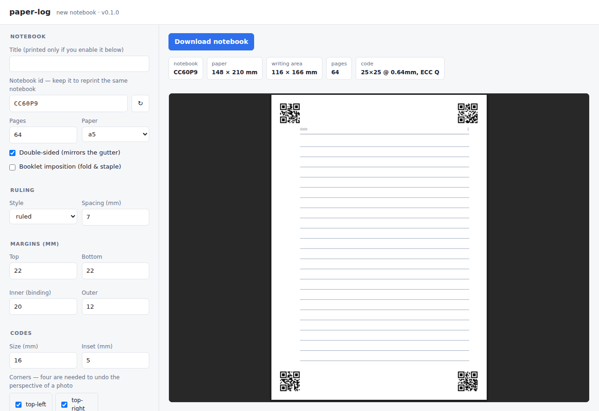

# paper-log

QR code identified journal pages to auto catalog my writing.

Generate printable journals whose pages identify themselves. Every page carries
QR codes in its corners encoding which notebook it belongs to, which page it
is, whether it is a front or a back, and which corner the code is in. Scan a
stack of handwritten pages and software can file them without you naming a
single file — in the right order, right way up, even if they went through the
feeder shuffled and upside down.

It works both ways: `paperlog build` makes the journal, `paperlog scan` reads
your photographs of it back, undoing the perspective of a hand-held phone and
filing each page under its own name.

```bash
paperlog build --preset a5-ruled --pages 64 --out journal.pdf   # print this
paperlog scan photos/ --pdf notebook.pdf                        # then photograph it
```

Pages, paper size, ruling, margins and the codes themselves are all
configurable, and the layout is checked before you print: paper-log tells you
if a code would land on top of your writing or come out too small to scan.

## Install

```bash
pip install -e .                 # making journals
pip install -e '.[verify]'       # + `paperlog scan` and `paperlog verify`
pip install -e '.[verify,heic]'  # + iPhone HEIC photographs
pip install -e '.[dev]'          # + the test suite
```

## Quick start

The easiest way to make a notebook is to look at it while you decide:

```bash
paperlog ui        # a form and a live PDF preview, on localhost
```



Pick a paper size, ruling and margins and watch the page redraw; the panel
above the preview shows the writing area and, importantly, how big each QR
module ends up. Press **Download notebook** for a zip with the print-ready PDF,
its manifest, and the config that made them.

From the command line instead:

```bash
paperlog presets                             # sizes, rulings, ready-made recipes
paperlog build --preset a5-dot --out j.pdf   # a 64-page A5 dot-grid journal
paperlog verify j.pdf                        # prove the codes actually decode
```

Or start from a config file and edit it:

```bash
paperlog init -o journal.yaml
paperlog build -c journal.yaml --out journal.pdf
```

### Just want to print something?

`examples/printable/` holds a ready-made 10-page A5 notebook — PDF, manifest and
the config that made it — for a real print-and-scan test run:

```bash
paperlog notebooks --add examples/printable/PAPER1.manifest.json   # so scan can find it
```

Print it at **100% / actual size** (not "fit to page" — scaling shrinks the codes
and desynchronises the manifest), double-sided, flipped on the long edge. Full
instructions and how to check it came out right: `examples/printable/README.md`.

## Using it end to end

```bash
# 1. make a notebook, however you like
paperlog ui                                    # or: paperlog build --preset a5-dot
#    -> journal.pdf + journal.manifest.json
#    -> and a copy filed in ~/.paperlog so step 4 can find it later

# 2. print it, double-sided, at 100% scale (no "fit to page")

# 3. write in it. photograph pages whenever — any order, any angle, any way up.
#    airdrop / copy them to a folder.

# 4. read them back
paperlog scan photos/ --pdf notebook.pdf
#    -> pages/K7M2QX/K7M2QX-p0001F.png, ...p0002B.png, ...
#    -> notebook.pdf, the pages in order
```

Step 4 takes no arguments because of step 1: building a notebook files a copy
of its manifest in `~/.paperlog`, and `paperlog scan` looks there. The manifest
is what says where the codes sit on the paper, so without it a photograph
cannot be turned back into a page — and "where did I put that file" is a
question that gets harder a year after printing.

```console
$ paperlog notebooks
2 notebook(s) in /home/you/.paperlog
  K7M2QX     64 pages  2026-03-02  Field notes
  8QR41M     32 pages  2025-11-19
```

Printed a notebook on another machine, or lost the library? Register its
manifest once with `paperlog notebooks --add path/to/journal.manifest.json`.
`--no-library` on either command opts out entirely, and `PAPERLOG_HOME`
moves it somewhere else.

### Practical notes

- **iPhone photos are HEIC**, which OpenCV cannot read. `pip install
  'paper-log[heic]'` handles it, or set Settings → Camera → Formats → Most
  Compatible to shoot JPEG. paper-log says which, rather than just failing.
- **Fill the frame with the page.** That is the single thing that decides
  whether the codes are readable — see the table below.
- **Rotation is fine**, sideways or upside down; EXIF rotation is honoured too.
- **Reshoot freely.** A second photo of the same page replaces the first if it
  is better, rather than making a second file.
- **An open spread works** — both pages come out as separate files.

Each build writes two files: `journal.pdf` to print, and
`journal.manifest.json` listing every page and the exact string in each of its
codes — the map your scanning pipeline reads.

## The page identifier

Each code holds one token. The default spelling is compact, because size is
the thing that decides whether a phone can read it:

```
PK7M2QX059BFZ
 \----------/
   60 bits: notebook (30) | page (13) | corner (2) | side (1) | crc (14)
```

13 characters fits **QR version 1 at error correction level Q** — a 21x21
symbol that tolerates losing a quarter of itself. The obvious readable
spelling, `PL1:K7M2QX:42:F:TR:51AA`, needs 25x25 for the same content. Same
printed square, 16% bigger modules, better error correction. You can still ask
for it with `token_format: readable`, and `paperlog decode` reads either.

Four decisions worth knowing about, since they are what makes the scanning end
easy:

**The corner is inside the token.** A code knows which corner of the page it
occupies. That gives orientation for free — a page photographed upside down
just produces a transform that includes the rotation, with no "which way up"
guess to get wrong — and it is what lets four codes pin down a perspective
correction.

**Every character is QR "alphanumeric".** Sticking to `0-9 A-Z` keeps the
symbol in the smallest version that will hold it; byte mode would cost a whole
version for the same content.

**There is a checksum.** 14 bits of CRC, which catches *every* single-character
corruption of a token (there is a test that tries all of them). A compact token
is opaque, so this is the only thing standing between a misread and a page
filed under the wrong number.

**Notebook ids use Crockford base32** — no I, L, O or U — so an id stays
unambiguous written on a cover. Six characters, a billion notebooks.

Decode one by hand at any time:

```console
$ paperlog decode PK7M2QX059BFZ
notebook  K7M2QX
page      42 (front)
corner    top-right
token     PK7M2QX059BFZ  ✓ checksum ok
```

Reprinting a notebook is just reusing its id — `--notebook-id K7M2QX`
regenerates identical tokens.

## Photographing pages

This is the workflow the defaults are tuned for. Photograph pages with a phone,
however they come — at an angle, rotated, upside down, in any order — and:

```console
$ paperlog scan photos/ -m journal.manifest.json --pdf notebook.pdf
photos    5
notebooks K7M2QX
  K7M2QX-p0001F  4 code(s), fit 0.15mm -> pages/K7M2QX/K7M2QX-p0001F.png
  K7M2QX-p0003F  4 code(s), fit 0.12mm -> pages/K7M2QX/K7M2QX-p0003F.png
  K7M2QX-p0004B  4 code(s), fit 0.16mm -> pages/K7M2QX/K7M2QX-p0004B.png
  K7M2QX-p0006B  4 code(s), fit 0.14mm -> pages/K7M2QX/K7M2QX-p0006B.png
  skipped IMG_1002.jpg: a better shot of K7M2QX-p0003F exists
missing   K7M2QX: no photo of page(s) 2, 5
bound     notebook.pdf
recovered 4 page(s), 0 photo(s) failed
```

What that does, in order:

1. **Finds the codes.** Not by searching the whole frame — the symbols are a
   few percent of a page photo and detectors downsample before they look.
   Searching overlapping tiles at full resolution finds four codes where a
   whole-frame search finds one, which is worth roughly a 1.5x cut in the
   resolution you need.
2. **Works out the page.** Each code names its notebook, page, side and corner.
3. **Undoes the perspective.** Each symbol contributes four point
   correspondences, so four codes give sixteen points spread to the corners of
   the sheet — a well-conditioned homography. The page comes out square-on at
   300dpi, at its true physical size, whichever way up you shot it.
4. **Evens out the lighting.** A photo carries the lamp with it. Dividing by an
   estimate of the paper level cancels that, so the page reads as white rather
   than "bright in one corner". `--enhance scan` goes further, to near
   black-and-white; `--enhance none` leaves it alone.
5. **Files and reports.** Named `NOTEBOOK-p0003F.png` so it sorts into reading
   order, deduplicated if you reshot a page (the better capture wins), with the
   pages you never photographed listed so you know what to go back for.

`--pdf` binds the recovered pages back into a notebook, in order, at the
original page size.

`fit` is the RMS reprojection error of the flattening, in millimetres on the
page — the honest measure of how square the result is. Under about 0.6mm is a
good fit; the tool warns past 1.5mm, which usually means a curled page or a
misread code.

### Will it work with my phone?

Measured against simulated captures — perspective tilt, in-plane rotation, a
background around the sheet, uneven lighting and vignetting, downscaling, focus
blur, sensor noise and JPEG compression. This is a simulation, so it tests the
geometry and the decoding rather than real optics; treat it as a floor, not a
promise.

Codes found, out of four, at the default 16mm:

| Photo width across the page | 13mm codes | **16mm (default)** | 20mm codes |
|---|---|---|---|
| 1200 px | 0 | 0 | 1–3 |
| 1600 px | 0 | 1–4 | 3–4 |
| 2000 px | 0–3 | **4** | 4 |
| 2400 px | 3–4 | **4** | 4 |
| 3000 px | 4 | **4** | 4 |

So: **fill the frame with the page**. A modern phone shooting 12MP gives you
3000–4000 px across an A5 page held at a sensible distance, which is well clear.
The failure mode to avoid is photographing the page small in a wide shot, or
letting a corner fall outside the frame.

You do not need all four codes. Three still gives a proper fit; two corrects
rotation and scale but not tilt; one identifies the page and is flagged as low
confidence. Any of them tells you *which page it is* — that never degrades.

With four codes in frame the flattening lands at 0.13–0.17mm RMS across the
whole page.

## Flatbed scanning

If you use a flatbed rather than a phone, everything gets easier. Reliability
comes down to one number: **the printed size of a single QR module**. The
defaults give 0.64mm, and `paperlog build` warns below 0.4mm.

At the default 16mm the codes read back from a **150dpi** scan and fail at
100dpi, where a module drops under three pixels. 300dpi is the sensible
default and leaves plenty of headroom. Under about 0.33mm per module nothing
survives real paper regardless of resolution — ink spreads and optics blur.

Longer payloads mean denser symbols, and density is exactly what you are
trying to avoid. `payload: "{token}"` is the smallest; a URL template like
`https://notes.example/p/{token}` is friendlier to a generic camera app but
pushes the symbol several versions up, so give it a bigger `qr.size` (see
`examples/url-payload.yaml`).

Every code in a run is printed at the same module pitch — sized for the highest
page number — so a scanner tuned on page 1 still works on page 200.

### Checking before you print

```console
$ paperlog verify journal.pdf
scanned   64 page(s) of journal.pdf at 300 dpi
decoded   128 code(s)
expected  128 code(s) across the whole document
ok        every code decoded and matches the manifest
```

This rasterises the finished PDF and runs a real decoder over it, then checks
what came back against the manifest. Worth doing before committing a long print
run to paper.

One caveat, because it shows up in the output: OpenCV's bundled QR detector is
noticeably less capable than the symbols it reads. It misses one code of four
on a large sheet and then reads it perfectly from a crop; it fails at 600dpi on
what it reads at 300; and on a handful of payloads it refuses a *pristine*
symbol at one scale while decoding the identical symbol at another. None of
that is about print quality.

So a page that comes up short is retried, in increasing order of help:

1. the whole page, multi-symbol — what a naive scanner does;
2. overlapping tiles, single-symbol — what a careful one does;
3. the exact region the manifest points at, resampled to a whole number of
   pixels per module;
4. failing all of those, the printed modules are compared bit for bit against
   the symbol the expected payload encodes — no decoder involved.

Steps 3 and 4 use the manifest as a map, which makes them *stricter* than a
blind scan rather than looser: the symbol still has to be the one that belongs
in that spot, so a wrong, misplaced or missing code fails either way. Every
retry switches off below 3 pixels per module, so codes too small to survive
real paper are never rescued by resampling.

`retried … needed a targeted crop` and `bit-check … confirmed correct module by
module` are therefore reports about the decoder, not warnings about your pages.

## Configuration

Lengths accept `mm` (the default), `cm`, `in` or `pt`: `7mm`, `0.25in`, `18pt`.
Unknown keys are errors, with a suggestion — a typo will not silently print you
the wrong notebook.

```yaml
notebook_id: K7M2QX4A
title: "Field notes"
pages: 64
duplex: true          # odd pages are fronts, even are backs; margins mirror
page_size: a5         # a3 a4 a5 a6 b5 b6 letter half-letter legal
                      # junior-legal pocket travelers travelers-passport
                      # or "148x210mm", "5.5in x 8.5in"
landscape: false
imposition: none      # or "booklet"

margins:
  top: 22mm           # top/bottom clear the codes, whatever the sides do
  bottom: 22mm
  inner: 20mm         # binding edge; swaps sides each page when duplex
  outer: 12mm         # (also accepts left/right, or "all")

ruling:
  style: ruled        # blank ruled dotted grid cornell
  spacing: 7mm
  line_width: 0.4
  color: "#9eabb9"    # hex, a 0-1 gray, or [r, g, b]
  first_line_offset: 0mm
  margin_rule: false  # vertical rule at the binding edge, legal-pad style
  margin_rule_offset: 12mm
  cue_column: 40mm    # cornell only
  summary_band: 45mm  # cornell only

qr:
  enabled: true
  corners: all        # all four; a photo needs four points to undo perspective
  size: 16mm          # footprint including the quiet zone
  inset: 5mm          # from the paper edge
  quiet_zone: 2       # in modules (see below)
  error_correction: q # l m q h
  token_format: compact   # 13 chars, 21x21 modules; or "readable"
  payload: "{token}"  # or "https://notes.example/p/{token}"
  caption: false      # print the page id in small type beside each code,
                      # auto-shrunk to fit and shortened to the page
                      # number where the header leaves no room
  color: "#000000"

fiducials:
  style: bracket      # bracket square cross none
  corners: auto       # "auto" = the corners without a QR code
  size: 5mm
  inset: 5mm

furniture:
  date_line: true
  date_label: date
  page_number: true
  page_number_format: "{page}"
  title: false
  header_rule: true
  font: Helvetica      # one of the 14 standard PDF fonts; nothing is embedded
  size: 7.5
```

Anything in the file can be overridden on the command line —
`paperlog build -c journal.yaml --pages 96 --ruling dotted --spacing 5mm`.
Run `paperlog build --help` for the full list.

**On `quiet_zone: 2`.** The QR spec asks for 4 modules of clear space, on the
assumption something might be printed against the symbol. Here the code sits
alone in a margin millimetres wide, so the paper supplies the real quiet zone
and a nominal 2 buys a ~15% bigger module in the same footprint. Raise it if
you move codes into a busy area.

**Fiducials** are registration marks in the corners that have no QR code. A QR
symbol is already a precise anchor, but only where one is printed; the marks
let a crop-and-deskew step find all four page corners even when a code is
smudged or covered by the writer's hand.

### Margins and corner clearance

A code overlaps your writing only if it overlaps in *both* axes, so a corner
can be cleared by widening either the top/bottom margin or the side margin next
to it — whichever costs less writing room. paper-log checks each corner
individually, on fronts and backs, and says which knob to turn:

```
warning:  The TR code overlaps the writing area on front pages. Give it 21mm of
          clearance: raise the top margin from 12mm, widen the side margin
          beside it, or shrink qr.size / qr.inset.
```

The default margins clear all four corners at the default code size.

## Booklets

`imposition: booklet` lays the pages out two-up on double-width sheets in
saddle-stitch order, with a dashed fold line and trim ticks:

```bash
paperlog build --preset a5-booklet --pages 32 --out booklet.pdf
```

Print double-sided flipping on the **short edge**, stack the sheets in order,
fold the pile in half, staple through the spine. Two A5 pages make an A4 sheet;
two half-letter make letter. Page counts are padded up to a multiple of 4,
since that is what a folded sheet holds.

## The design UI

`paperlog ui` serves a form with a live preview at
<http://127.0.0.1:8765>. It is deliberately dependency-free — the server is
Python's own `http.server`, and the preview is the real PDF rendered by the
browser, so there is no web framework and no JavaScript to install.

It binds to loopback only and has no authentication, which is the right trade
for a tool one person runs on their own machine. Don't put it on a public
interface with `--host`.

## Python API

```python
from paperlog import JournalConfig, build

config = JournalConfig.from_dict({
    "page_size": "a5",
    "pages": 64,
    "ruling": {"style": "dotted", "spacing": "5mm"},
    "qr": {"corners": "all"},
})

for note in config.warnings():
    print("warning:", note)

result = build(config, "journal.pdf")
print(result.pdf_path, result.manifest_path)
for page in result.pages:
    print(page.number, page.side, page.token)
```

## The manifest

```json
{
  "manifest_version": 1,
  "notebook": { "id": "K7M2QX4A", "page_count": 64, "duplex": true },
  "page": { "width_mm": 148.0, "height_mm": 210.0, "ruling": "ruled" },
  "token_format": {
    "grammar": "PL1:<notebook>:<page>:<F|B>:<TL|TR|BL|BR>:<crc16>",
    "checksum": "CRC-16/CCITT-FALSE over the token up to but excluding the final colon, hex, upper case"
  },
  "qr": {
    "corners": ["TL", "BR"],
    "modules": 29,
    "module_size_mm": 0.448,
    "geometry": {
      "TL": { "x_mm": 5.0, "y_mm": 192.0, "size_mm": 13.0 },
      "BR": { "x_mm": 130.0, "y_mm": 5.0, "size_mm": 13.0 }
    }
  },
  "pages": [
    {
      "page": 1,
      "side": "F",
      "token": "PL1:K7M2QX4A:1:F:TL:0370",
      "codes": {
        "TL": "PL1:K7M2QX4A:1:F:TL:0370",
        "BR": "PL1:K7M2QX4A:1:F:BR:595A"
      }
    }
  ]
}
```

Geometry is in millimetres from the bottom-left of the page, and ``size_mm`` is
the printed footprint *including* the quiet zone — a detector reports the
bounds of the dark symbol, so subtract ``quiet_zone_modules`` worth before
matching photo points to page coordinates. Getting that wrong costs a
systematic 1.3mm and still looks plausible. `token_format` is spelled out in full so the scanning
side can be written against the manifest alone — and `paperlog/ids.py`
implements the whole scheme, CRC included, in one dependency-free file if you
would rather port it.

## Tests

```bash
python -m pytest
```

The suite renders journals, rasterises them, and decodes the codes back. The
capture tests go further and put every page through a **simulated phone
camera** — perspective, rotation, uneven light, downscaling, blur, noise, JPEG
— then check the page is identified and flattened to within a fraction of a
millimetre, including upside down and 90 degrees off.

Negative cases matter as much: undersized codes, mismatched manifests, blank
frames, unknown notebooks and too-low resolutions are all expected to be
rejected, so the checks can actually fail. Tests needing the `[verify]` extras
skip without them.
